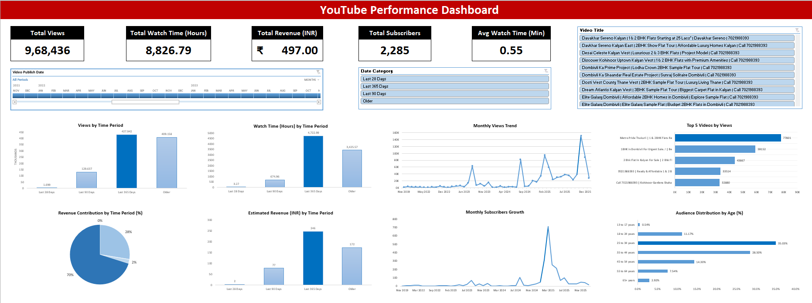

# YouTube Performance Analytics Dashboard

## 📷 Dashboard Preview

## 📊 Project Overview
Developed an interactive Excel dashboard to analyze YouTube channel performance including views, watch time, revenue, subscribers, and audience demographics.

## 🚀 Key Features
- KPI tracking (Views, Watch Time, Revenue, Subscribers)
- Time-series analysis (28/90/365 day comparison)
- Revenue contribution analysis
- Audience segmentation (Age demographics)
- Subscriber growth trend analysis
- Interactive slicers for dynamic filtering

## 🛠 Skills Demonstrated
- Data Analysis
- Data Visualization
- KPI Development
- Time-Series Analysis
- Audience Segmentation
- Business Insight Generation

## 🧰 Tools & Technologies
- Microsoft Excel
- Pivot Tables
- Pivot Charts
- Slicers
- Data Cleaning

## 📊 Business Impact
- Identified 70% revenue driven by evergreen content
- Detected subscriber growth spike in early 2025
- Highlighted retention improvement opportunity (0.55 avg watch time)

## 📈 Insights Generated
- 70% of revenue driven by evergreen content
- Significant subscriber spike in early 2025
- Core audience segment: 25–44 years
- Opportunity to improve retention and RPM

## 🛠 Tools Used
- Microsoft Excel
- Pivot Tables
- Pivot Charts
- Data Visualization
- KPI Development

## 📁 Files Included
- Excel Dashboard File
- Presentation PDF
- Dashboard Screenshot

---

## 👤 Author

Jayesh Kamble

